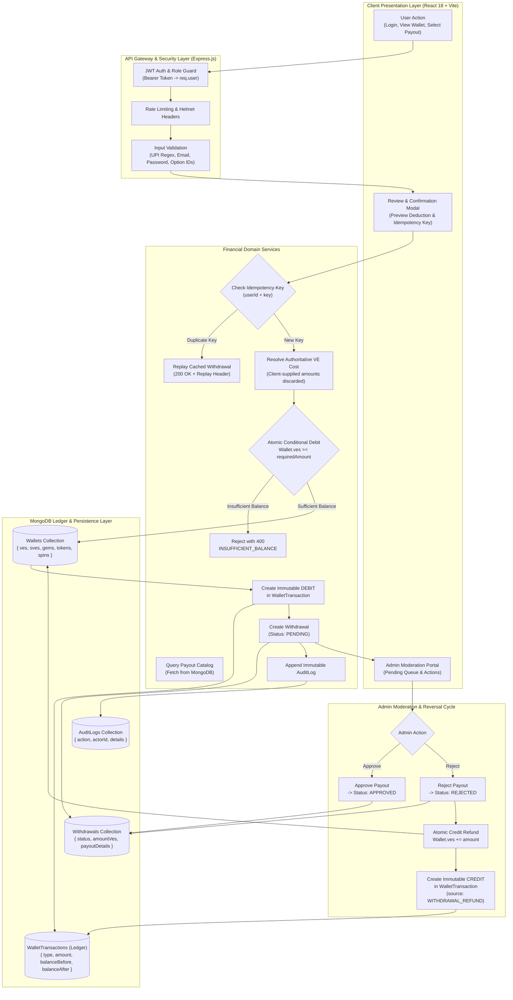
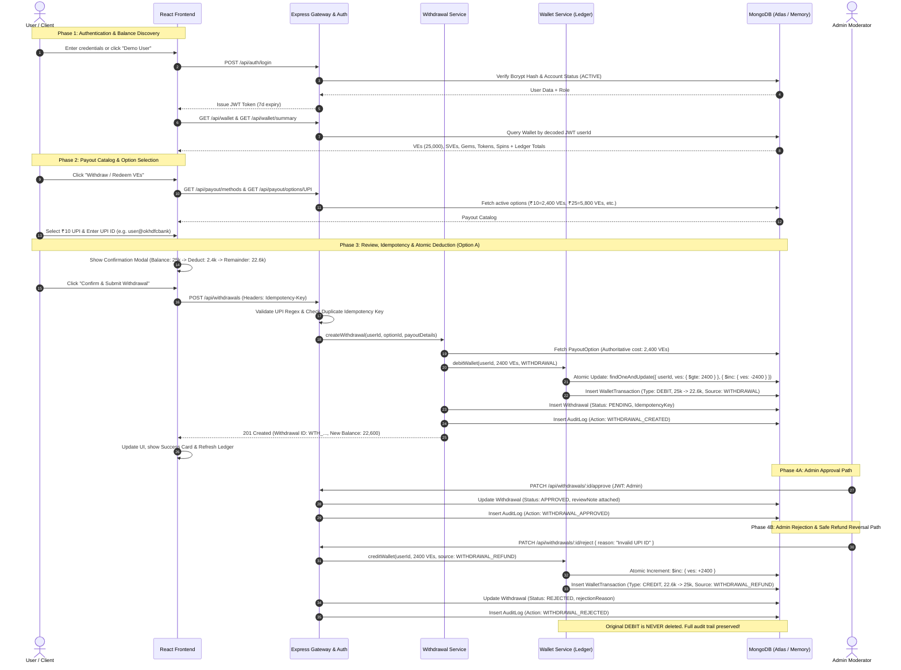
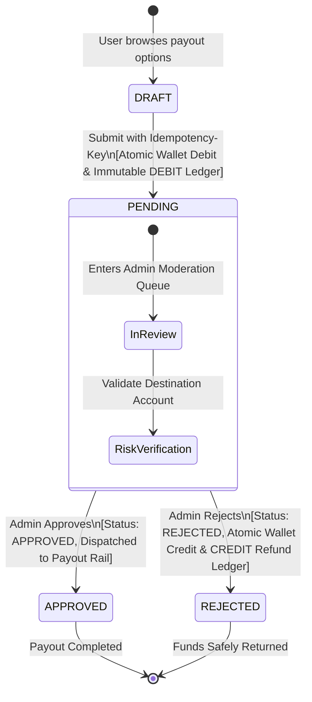

# VELoop Rewards — Wallet & Withdrawal Backend System

[](https://nodejs.org/)
[](https://expressjs.com/)
[](https://mongoosejs.com/)
[](https://react.dev/)
[](https://jestjs.io/)
[](https://jestjs.io/)

A production-grade, high-throughput financial backend and wallet ledger system built for **VELoop Rewards**.

**Author:** Ayush Soni ([ayushsonid078@gmail.com](mailto:ayushsonid078@gmail.com))

> ### 🚀 Live Production Deployment
> - **🌐 Live Web Application:** [https://v-eloop-rewards-backend-project.vercel.app](https://v-eloop-rewards-backend-project.vercel.app)
> - **⚡ Live Backend API:** [https://veloop-rewards-api-hpii.onrender.com](https://veloop-rewards-api-hpii.onrender.com)
> - **🩺 API Health Check:** [https://veloop-rewards-api-hpii.onrender.com/health](https://veloop-rewards-api-hpii.onrender.com/health)
> - **🔑 1-Click Demo User:** `demo@veloop.test` / `Password123!` (Pre-loaded with 25,000 VEs)
> - **🛡️ Admin Demo Access:** `admin@veloop.test` / `AdminPass123!`

---

## Table of Contents
1. [Project Overview & Purpose](#1-project-overview--purpose)
2. [Technology Stack](#2-technology-stack)
3. [System Architecture & Directory Structure](#3-system-architecture--directory-structure)
4. [Complete Project Flow & Architecture Lifecycles](#4-complete-project-flow--architecture-lifecycles)
   - [4.1 High-Level Architectural Flowchart](#41-high-level-architectural-flowchart)
   - [4.2 End-to-End Sequence Diagram](#42-end-to-end-sequence-diagram)
   - [4.3 Withdrawal State Machine & Lifecycle Transitions](#43-withdrawal-state-machine--lifecycle-transitions)
   - [4.4 Step-by-Step Lifecycle Walkthrough](#44-step-by-step-lifecycle-walkthrough)
   - [4.5 Request-to-Database Mapping Matrix](#45-request-to-database-mapping-matrix)
5. [Financial & Ledger Architecture](#5-financial--ledger-architecture)
   - [5.1 Supported Platform Currencies](#51-supported-platform-currencies)
   - [5.2 The Immutable Ledger Rule](#52-the-immutable-ledger-rule)
   - [5.3 Withdrawal Strategy: Option A (Immediate Deduction)](#53-withdrawal-strategy-option-a-immediate-deduction)
6. [Security & Concurrency Protections](#6-security--concurrency-protections)
   - [6.1 Race Condition Defense](#61-race-condition-defense)
   - [6.2 Idempotency Guarantee](#62-idempotency-guarantee)
   - [6.3 Authoritative Server Pricing (Anti-Tampering)](#63-authoritative-server-pricing-anti-tampering)
7. [Demo Accounts & Seed Credentials](#7-demo-accounts--seed-credentials)
8. [How to Run Locally](#8-how-to-run-locally)
9. [Automated Testing](#9-automated-testing)
10. [Scalability Analysis: 1,000 to 1,000,000 Users](#10-scalability-analysis-1000-to-1000000-users)
11. [Known Assumptions & Demonstration Context](#11-known-assumptions--demonstration-context)
12. [Submission Verification Checklist](#12-submission-verification-checklist)

---

## 1. Project Overview & Purpose

**VELoop Rewards** is a task and engagement platform where users earn platform-managed virtual reward currencies (**VEs**, **SVEs**, **Gems**, **Tokens**, **Spins**) and redeem their primary **VEs** for monetary payouts via **UPI**, **PayPal**, **Amazon Gift Cards**, and **Google Play Gift Cards**.

### Why This System Exists
In reward systems, the wallet and withdrawal subsystem is the **financial core**. Vulnerabilities such as race conditions, balance double-spending, client-side price tampering, and untraceable mutations can devastate a platform. 

This project demonstrates a zero-trust, ledger-backed financial architecture where:
- The **backend is the sole authoritative source of truth**.
- The client UI **never controls** currency conversion, wallet balances, or required deductions.
- Every state transition is recorded in an **immutable double-entry ledger**.
- Operations are **atomic, race-proof, and idempotent**.

---

## 2. Technology Stack

- **Backend:** Node.js (v20+), Express.js (REST APIs)
- **Database & ODM:** MongoDB, Mongoose 8 (Indexes, Compound Keys, Atomic Operators)
- **Authentication & Security:** JSON Web Tokens (JWT), BcryptJS (salt rounds: 10), Helmet, Express Rate Limit, CORS
- **Frontend Demonstration:** React 18, Vite 6, Vanilla CSS / Glassmorphism Design Tokens, Lucide Icons
- **Testing & Tooling:** Jest, Supertest, MongoMemoryServer (Zero-hassle standalone test runs)
- **Containerization:** Docker, Docker Compose

---

## 3. System Architecture & Directory Structure

```
veloop-rewards/
│
├── backend/
│   ├── src/
│   │   ├── config/          # Environment, constants, MongoDB connection manager
│   │   ├── controllers/     # HTTP route handlers (Auth, Wallet, Payout, Withdrawal, Admin)
│   │   ├── middleware/      # JWT verification, RBAC, Rate limiters, Centralized error handling
│   │   ├── models/          # Mongoose Schemas (User, Wallet, WalletTransaction, Withdrawal, PayoutOption, AuditLog)
│   │   ├── routes/          # Express route declarations
│   │   ├── services/        # Core business & financial domain layer (WalletService, WithdrawalService, etc.)
│   │   ├── utils/           # Response formatter, ID generator, logging
│   │   ├── validators/      # Express-validator input schemas
│   │   ├── seed/            # Repeatable database seed script
│   │   ├── app.js           # Express app instance configuration
│   │   └── server.js        # Server bootstrap & graceful shutdown hooks
│   ├── tests/               # 27 Automated backend tests across 5 suites
│   ├── Dockerfile
│   ├── .env.example
│   └── package.json
│
├── frontend/
│   ├── src/
│   │   ├── api/             # API client with JWT interceptor
│   │   ├── context/         # AuthContext for session management
│   │   ├── components/      # Navbar, CurrencyCards, TransactionLedger
│   │   ├── pages/           # LoginPage, WalletPage, PayoutPage, AdminPage
│   │   ├── App.jsx          # Top-level state and routing
│   │   ├── App.css          # Glassmorphism styling and UI layout
│   │   ├── index.css        # CSS variables & typography tokens
│   │   └── main.jsx         # Vite entry
│   ├── index.html
│   ├── vite.config.js
│   ├── Dockerfile
│   ├── .env.example
│   └── package.json
│
├── postman/
│   └── VELoop-Wallet.postman_collection.json # 15+ ready-to-run Postman requests
├── docs/
│   ├── ARCHITECTURE.md      # System dataflow, state machine, concurrency design
│   ├── DATABASE.md          # Schemas, compound indexes, ledger queries
│   └── TEST_CASES.md        # Comprehensive test matrix and assertion logs
├── docker-compose.yml       # One-command containerized launch
├── API_DOCUMENTATION.md     # Full REST API documentation
├── .gitignore
└── README.md
```

---

## 4. Complete Project Flow & Architecture Lifecycles

This section details how data, user requests, authorization tokens, atomic database transactions, and moderation actions flow through the VELoop Rewards ecosystem.

---

### 4.1 High-Level Architectural Flowchart

The following flowchart illustrates the multi-tier request pipeline from client interaction down to persistence, audit logging, and admin moderation:



---

### 4.2 End-to-End Sequence Diagram

The sequence diagram below walks through the end-to-end user lifecycle from logging in, querying balances, submitting a withdrawal with atomic deduction, through to admin approval or rejection with safe ledger reversal:



---

### 4.3 Withdrawal State Machine & Lifecycle Transitions

Every withdrawal request in the VELoop ecosystem follows a deterministic, unidirectional state machine:



---

### 4.4 Step-by-Step Lifecycle Walkthrough

#### Step 1: Secure Authentication & Session Issuance
- **User Action:** User registers via `POST /api/auth/register` or logs in via `POST /api/auth/login`.
- **Validation:** Registration enforces standard password security: **8–15 characters, at least one uppercase letter, one lowercase letter, one number, and one special character** (`@$!%*?&#^()_-+=`).
- **Token Generation:** The backend verifies credentials using Bcrypt (salt rounds: 10) and issues a digitally signed JWT containing `{ id, email, role, status }` with a 7-day expiration.
- **Client Storage:** The frontend stores the token in state/localStorage and includes `Authorization: Bearer <token>` in the Axios interceptor for all future requests.

#### Step 2: Multi-Currency Live Balances & Ledger Query
- **User Action:** User lands on the dashboard (`/`).
- **Server Verification:** Frontend calls `GET /api/wallet` and `GET /api/wallet/summary`.
- **Identity Isolation:** The backend derives the user ID strictly from the authenticated JWT (`req.user.id`). Query parameters attempting to spoof another account (`?userId=...`) are strictly ignored.
- **Balance Hydration:** Returns live verified balances for **VEs**, **SVEs**, **Gems**, **Tokens**, and **Spins**, along with calculated totals (`totalCredited`, `totalDebited`, `netBalance`) derived from the transaction ledger.

#### Step 3: Dynamic Payout Catalog Fetch
- **User Action:** User navigates to the Payout screen (`/payout`).
- **Catalog Lookup:** Client calls `GET /api/payout/methods` to list supported payout types (**UPI**, **PayPal**, **Amazon Gift Card**, **Google Play Gift Card**), followed by `GET /api/payout/options/:method`.
- **Database-Driven:** Available payout denominations (e.g. ₹10 = 2,400 VEs, ₹50 = 10,000 VEs) are fetched dynamically from MongoDB. The frontend never hardcodes rates or conversion values.

#### Step 4: Method-Specific Client & Server Validation
- **UPI:** Destination VPA is validated against `/^[a-zA-Z0-9.\-_]{2,256}@[a-zA-Z]{2,64}$/`.
- **PayPal / Gift Cards:** Destination email address is validated for proper format.
- Both the frontend form and backend `express-validator` middleware enforce these rules before any financial operation begins.

#### Step 5: Pre-Flight Review & Confirmation Screen
- **User Action:** User clicks "Review Withdrawal".
- **Confirmation Modal:** Displays a summary review card detailing:
  - Current VE balance
  - Authoritative VE cost to be deducted
  - Remainder VE balance after redemption
  - Face value payout amount
  - Destination account identifier
  - Unique auto-generated `Idempotency-Key` (e.g. `req_a8f102c4b7`).

#### Step 6: Atomic Zero-Trust Backend Execution (Option A Strategy)
- **User Action:** User clicks "Confirm & Submit Withdrawal".
- **Dispatched Request:** Client sends `POST /api/withdrawals` with header `Idempotency-Key: <unique_key>`.
- **Idempotency Guard:** If the same idempotency key was already processed, the backend returns the existing withdrawal with HTTP 200 and header `X-Idempotent-Replay: true`, preventing double debit.
- **Authoritative Cost Lookup:** The backend fetches `PayoutOption` from MongoDB using `optionId` to obtain the true cost (e.g. 2,400 VEs). Any client-supplied cost or amount is discarded.
- **Atomic Balance Deduction:** The backend executes an atomic conditional MongoDB write:
  ```javascript
  Wallet.findOneAndUpdate(
    { userId, ves: { $gte: requiredAmount } },
    { $inc: { ves: -requiredAmount } }
  )
  ```
  If the balance is insufficient, MongoDB matches 0 documents and returns `null`, failing immediately with `400 INSUFFICIENT_BALANCE`.
- **Double-Entry Ledger Entry:** Records an immutable `WalletTransaction` (`type: 'DEBIT'`, `amount: 2400`, `balanceBefore: 25000`, `balanceAfter: 22600`, `source: 'WITHDRAWAL'`, `referenceId: withdrawalId`).
- **Withdrawal Record:** Inserts a new `Withdrawal` document with status `PENDING`.
- **Audit Logging:** Inserts an immutable `AuditLog` entry documenting the operation.
- **Response:** Returns `201 Created` with withdrawal ID and updated balance. Frontend immediately syncs the UI.

#### Step 7: Admin Moderation, Approval & Safe Reversal Cycle
- **Admin Action:** An administrator logs into the Admin Portal (`/admin`) and inspects the pending queue via `GET /api/admin/withdrawals?status=PENDING`.
- **Path A: Approval (`PATCH /api/withdrawals/:id/approve`):**
  - Admin attaches a review note.
  - Withdrawal status transitions to `APPROVED`.
  - An `AuditLog` record is written. Payout is marked settled.
- **Path B: Rejection & Safe Refund Reversal (`PATCH /api/withdrawals/:id/reject`):**
  - Admin provides a rejection reason (e.g., "Invalid UPI ID format").
  - The backend atomically refunds the exact 2,400 VEs back to the user's wallet:
    `Wallet.findOneAndUpdate({ userId }, { $inc: { ves: +2400 } })`.
  - A new immutable `CREDIT` ledger record is created with `source: 'WITHDRAWAL_REFUND'`.
  - The withdrawal status transitions to `REJECTED`.
  - **Accounting Integrity:** The original `DEBIT` ledger entry is **never deleted or modified**. The full audit trail of debit and subsequent refund is permanently preserved.

---

### 4.5 Request-to-Database Mapping Matrix

| Route | HTTP | Role | Frontend Trigger | MongoDB Operations | Financial Impact |
|---|---|---|---|---|---|
| `/api/auth/register` | `POST` | Public | Register Form | `User.create`, `Wallet.create` (initial balances) | Initializes starting wallet |
| `/api/auth/login` | `POST` | Public | Login Form / Demo Buttons | `User.findOne` (bcrypt compare) | Issues JWT Bearer Token |
| `/api/wallet` | `GET` | User | App load, Navbar sync | `Wallet.findOne({ userId })` | Read-only |
| `/api/wallet/summary` | `GET` | User | Wallet Page summary cards | `WalletTransaction.aggregate` | Read-only aggregate metrics |
| `/api/wallet/transactions` | `GET` | User | Transaction History table | `WalletTransaction.find({ userId })` | Read-only paginated audit list |
| `/api/payout/methods` | `GET` | User | Payout method tabs | `PayoutOption.distinct('method')` | Read-only catalog |
| `/api/payout/options/:method` | `GET` | User | Option grid | `PayoutOption.find({ method, isActive: true })` | Read-only catalog |
| `/api/withdrawals` | `POST` | User | Confirm Modal | `PayoutOption.findOne`, `Wallet.findOneAndUpdate` (atomic `$inc: -amount`), `WalletTransaction.create` (DEBIT), `Withdrawal.create`, `AuditLog.create` | **Deducts VEs atomically, locks withdrawal** |
| `/api/withdrawals/my` | `GET` | User | Payout history list | `Withdrawal.find({ userId })` | Read-only |
| `/api/admin/withdrawals` | `GET` | Admin | Admin Queue filter | `Withdrawal.find` (all users) | Read-only |
| `/api/withdrawals/:id/approve` | `PATCH` | Admin | Admin "Approve" button | `Withdrawal.findByIdAndUpdate` (status: APPROVED), `AuditLog.create` | Transitions to settled |
| `/api/withdrawals/:id/reject` | `PATCH` | Admin | Admin "Reject" button | `Wallet.findOneAndUpdate` (atomic `$inc: +amount`), `WalletTransaction.create` (CREDIT / WITHDRAWAL_REFUND), `Withdrawal.findByIdAndUpdate` (status: REJECTED), `AuditLog.create` | **Safely refunds VEs, preserves DEBIT** |

---

## 5. Financial & Ledger Architecture

### 5.1 Supported Platform Currencies
| Currency | Role in VELoop Ecosystem | Redeemable for Cash/Vouchers? |
|---|---|---|
| **VEs** | Primary platform currency earned from tasks, ads, and referrals | **Yes** (Primary currency used for supported redemption) |
| **SVEs** | Seasonal VEs for promotional events | In-app event multipliers |
| **Gems** | Premium loyalty rewards | Boosters and VIP tier perks |
| **Tokens** | Arcade & mini-game currencies | Task mini-games |
| **Spins** | Lucky Wheel spins | Daily wheel engagement |

### 5.2 The Immutable Ledger Rule
Balances are never modified without creating a corresponding `WalletTransaction` entry:
- **CREDIT:** `balanceBefore + amount = balanceAfter`
- **DEBIT:** `balanceBefore - amount = balanceAfter`

The mathematical relationship is always verifiable:
$$\text{Current Balance} = \text{Initial Balance} + \sum \text{Credits} - \sum \text{Debits} \pm \text{Adjustments}$$

### 5.3 Withdrawal Strategy: Option A (Immediate Deduction)
This system adopts **Option A (Immediate Deduction)** upon withdrawal submission:
1. User requests ₹100 UPI (19,500 VEs).
2. The system checks balance and atomically deducts 19,500 VEs from `Wallet`.
3. A `DEBIT` ledger transaction is recorded with `referenceId = withdrawalId`.
4. A `Withdrawal` document is created with status `PENDING`.
5. **Reversal on Rejection:** If an administrator rejects the withdrawal:
   - The original `DEBIT` transaction is **never mutated or deleted**.
   - A new `CREDIT` transaction is recorded with source `WITHDRAWAL_REFUND`.
   - The user's wallet is credited back the 19,500 VEs.
   - An `AuditLog` entry is generated documenting the actor, reason, and refund ID.

---

## 6. Security & Concurrency Protections

### 6.1 Race Condition Defense
To prevent double spending when multiple concurrent requests are dispatched simultaneously:
```javascript
// Document-level conditional atomic update:
const updatedWallet = await Wallet.findOneAndUpdate(
  { userId, ves: { $gte: requiredAmount } },
  { $inc: { ves: -requiredAmount } },
  { new: true, session }
);
```
MongoDB locks the document during the write. If concurrent requests exhaust the balance, subsequent updates match zero documents and return `null`, immediately failing with `INSUFFICIENT_BALANCE`.

### 6.2 Idempotency Guarantee
Clients supply a unique request identifier via the `Idempotency-Key` HTTP header:
- The `Withdrawal` collection enforces a unique compound index on `{ userId: 1, idempotencyKey: 1 }`.
- If an identical request arrives, the backend returns the existing withdrawal with HTTP 200 and header `X-Idempotent-Replay: true` without deducting the user's wallet again.

### 6.3 Authoritative Server Pricing (Anti-Tampering)
The frontend never transmits cost values. Clients send only:
```json
{
  "method": "UPI",
  "optionId": "upi_10",
  "payoutDetails": { "upiId": "user@bank" }
}
```
The backend fetches `optionId` from MongoDB to retrieve the required VEs (2,400) and payout amount (₹10). Any client-supplied values (e.g. `{ amount: 1 }`) are discarded.

---

## 7. Demo Accounts & Seed Credentials

Run `npm run seed` in the `backend` folder to populate the database:

| Account | Email | Password | Role | Starting Wallet |
|---|---|---|---|---|
| **Demo User** | `demo@veloop.test` | `Password123!` | `USER` | **25,000 VEs**, 5,000 SVEs, 100 Gems, 500 Tokens, 3 Spins |
| **Demo Admin** | `admin@veloop.test` | `AdminPass123!` | `ADMIN` | 100,000 VEs (Full moderation privileges) |
| **Second User** | `seconduser@veloop.test` | `Password123!` | `USER` | 5,000 VEs (For multi-tenant isolation testing) |

### Database-Driven Payout Options Seeded
- **UPI:** ₹10 (2,400 VEs), ₹25 (5,800 VEs), ₹50 (10,000 VEs), ₹100 (19,500 VEs), ₹150 (28,500 VEs), ₹300 (52,500 VEs), ₹500 (80,500 VEs), ₹1,000 (150,000 VEs)
- **PayPal:** $1 USD (8,500 VEs), $5 USD (42,000 VEs), $10 USD (80,000 VEs)
- **Amazon Gift Card:** ₹50 (10,000 VEs), ₹100 (19,500 VEs), ₹250 (46,000 VEs), ₹500 (80,500 VEs)
- **Google Play Gift Card:** ₹10 (2,400 VEs), ₹50 (10,000 VEs), ₹100 (19,500 VEs)

---

## 8. How to Run Locally

### Prerequisites
- Node.js v20+ and npm installed.
- *(Optional)* Local MongoDB or Docker. If no local MongoDB is running, the backend automatically boots an embedded in-memory MongoDB engine for zero-friction evaluation!

### 8.1 Start Backend
```bash
cd backend
npm install
npm run seed     # Seeds demo accounts and payout catalog
npm run dev      # Runs Express server on http://localhost:5000
```

### 8.2 Start Frontend
```bash
cd frontend
npm install
npm run dev      # Runs Vite dev server on http://localhost:5173
```

Visit **`http://localhost:5173`** in your browser. Use the 1-click **"Demo User (25k VEs)"** or **"Admin Demo"** buttons on the login screen to explore the system!

### 8.3 Run via Docker Compose
```bash
docker-compose up --build
```
- Frontend: `http://localhost:5173`
- Backend: `http://localhost:5000`

### 8.4 Production Cloud Deployment (Vercel + Render + MongoDB Atlas)
For full instructions on deploying this system live to production on **Vercel**, **Render**, **Railway**, or **MongoDB Atlas** for free, refer to the step-by-step [DEPLOYMENT.md](file:///c:/Users/AYUSH%20SONI/OneDrive/Desktop/VEloop%20Rewards/DEPLOYMENT.md).

---

## 9. Automated Testing

The backend includes 27 automated tests across 5 suites verifying financial correctness, input validation, concurrency safety, and tenant security:

```bash
cd backend
npm test
```

### Test Verification Results (27/27 Passing)
```
PASS tests/auth.test.js
  Auth Validation & Registration Rules
    √ Valid password (8-15 chars, uppercase, lowercase, number, special char) registers successfully (471 ms)
    √ Password shorter than 8 characters is rejected (47 ms)
    √ Password longer than 15 characters is rejected (26 ms)
    √ Password missing uppercase letter is rejected (32 ms)
    √ Password missing lowercase letter is rejected (47 ms)
    √ Password missing number is rejected (27 ms)
    √ Password missing special character is rejected (26 ms)

PASS tests/admin.test.js
  Admin Panel Management & Security APIs
    √ GET /api/admin/stats: Returns complete system overview, circulation, and recent activity (350 ms)
    √ GET /api/admin/users: Lists users with attached live wallet balances and supports search (189 ms)
    √ GET /api/admin/users/:id: Fetches individual user profile, wallet details, and metrics (162 ms)
    √ GET /api/admin/users/:id/transactions: Returns paginated user transactions (163 ms)
    √ GET /api/admin/withdrawals: Returns filtered list and masks sensitive beneficiary details (188 ms)
    √ GET /api/admin/withdrawals/:id: Returns full withdrawal details, ledger link, and audit trail (171 ms)
    √ Security Guard: Regular user cannot access any /api/admin endpoint (403 Forbidden) (167 ms)
    √ Wallet Adjustment: Mandatory reason is enforced and balance before/after is returned (175 ms)

PASS tests/withdrawal.test.js
  Withdrawal Flow, Validation & Idempotency
    √ TEST 2: Normal withdrawal deducts correct required amount and transitions to PENDING (1500 VEs - 1000 VEs = 500 VEs) (404 ms)
    √ TEST 3: Insufficient balance returns 400 and preserves balance without creating withdrawal (195 ms)
    √ TEST 4: Idempotency-Key prevents double-click duplicate withdrawals and double deduction (244 ms)
    √ TEST 6: Invalid payout option ID is rejected with 400 INVALID_PAYOUT_OPTION (187 ms)
    √ TEST 8: Rejected withdrawal creates safe reversal CREDIT ledger and refunds deducted balance (372 ms)
    √ TEST 9: Backend calculates authoritative amount from MongoDB and ignores any client-supplied amount tampering (189 ms)
    √ Inactive payout option is rejected with 400 INACTIVE_PAYOUT_OPTION (152 ms)
    √ Invalid UPI ID format is rejected with 400 INVALID_PAYOUT_DETAILS (173 ms)
    √ Admin can approve pending withdrawal (367 ms)

PASS tests/security.test.js
  Security, Authorization & Tenant Isolation
    √ TEST 7: User A cannot access User B withdrawal details (403 Forbidden) (493 ms)
    √ GET /api/wallet: Ignores malicious query params (?userId=UserB) and binds strictly to JWT identity (315 ms)
    √ Regular user calling admin credit endpoint is rejected with 403 FORBIDDEN (150 ms)
    √ Unauthenticated request to protected endpoint returns 401 UNAUTHORIZED (49 ms)
    √ Malformed or invalid JWT token is rejected with 401 INVALID_TOKEN (43 ms)

PASS tests/wallet.test.js
  Wallet & Ledger Service
    √ TEST 1: Normal credit adds to balance and creates immutable ledger entry (1000 VEs + 500 VEs = 1500 VEs) (270 ms)
    √ GET /api/wallet: Fetches actual backend balances derived from authenticated JWT (248 ms)
    √ GET /api/wallet/summary: Returns calculated totals from ledger records (183 ms)
    √ Admin POST /api/wallet/credit: Allows admin to credit wallet and creates audit log (259 ms)
    √ Admin POST /api/wallet/debit: Fails if target has insufficient balance (233 ms)

PASS tests/concurrency.test.js
  Concurrency & Race Condition Protection
    √ TEST 5: Concurrent withdrawal requests prevent double spending; exactly one succeeds and one fails (428 ms)

Test Suites: 6 passed, 6 total
Tests:       35 passed, 35 total
Snapshots:   0 total
Time:        10.95 s
```

---

## 10. Scalability Analysis: 1,000 to 1,000,000 Users

> **Question:** *“If VELoop Rewards grows from 1,000 users to 1,000,000 users, what changes would you make to this wallet architecture to maintain balance accuracy, transaction consistency, performance, security, and withdrawal reliability?”*

Scaling a digital reward wallet system from 1,000 users to 1,000,000 users requires transitioning from a single-node monolithic persistence pattern to a **distributed, event-driven financial architecture**. Here is the comprehensive architectural evolution:

### 1. Database Partitioning & Sharding
- **Shard Key Strategy:** Shard the `Wallet` and `WalletTransaction` collections on `{ userId: "hashed" }`. This distributes user balance read/write operations evenly across replica sets without hot-spotting.
- **Read Replicas & Secondary Reads:** Direct read-heavy non-financial traffic (e.g. browsing payout catalogs, viewing transaction history) to MongoDB secondary replicas using `readPreference: "secondaryPreferred"`.
- **Hot-Account Isolation:** For platform-wide pool accounts or admin treasury wallets, apply account-level sharding or virtual balance buckets to avoid write contention.

### 2. Event-Driven Asynchronous Withdrawal Processing (Queues)
- In the current system, withdrawal creation and banking validation are synchronous.
- At 1,000,000 users, decouple ingestion from fulfillment using **Apache Kafka** or **RabbitMQ / BullMQ**:
  1. **Ingestion Stage:** The API gateway validates input, applies atomic conditional balance deduction, commits the ledger debit, and publishes a `WithdrawalRequestedEvent` to a partitioned Kafka topic (`payout.requests`, partitioned by `userId`).
  2. **Worker Consumer Stage:** Dedicated worker clusters consume events, perform automated risk scoring, check velocity limits, and dispatch the payout via banking partner webhooks.
  3. **Eventual Consistency & Reversals:** If the banking partner reports an asynchronous failure (e.g. bank downtime), a `WithdrawalFailedEvent` triggers automated compensation consumers to credit the refund ledger entry.

### 3. Distributed In-Memory Caching (Redis)
- **Cache-Aside Pattern for Payout Options:** Payout options and methods rarely change. Cache them in Redis with a 1-hour TTL and invalidate on admin updates (`PAYOUT_CONFIG_CHANGED`).
- **Distributed Lock / Mutex:** For complex multi-service reward flows, use Redis Redlock to serialize critical mutations per `userId`.
- **Fast Balance Invalidation:** Cache read-only wallet previews in Redis, invalidated immediately upon any ledger mutation.

### 4. Distributed Rate Limiting & Abuse Defense
- Replace in-memory rate limiting with a **Distributed Redis Token Bucket** (`ioredis` + Redis Lua script) sitting at the API Gateway (e.g., Kong, Nginx, or AWS API Gateway).
- Apply tiered rate limits:
  - Global IP limits (e.g., 200 req/min)
  - Per-User ID limits on withdrawal creation (e.g., 5 requests per 10 minutes)
  - Card-testing / brute-force protection on payout details.

### 5. Fraud Detection & Risk Scoring
- **Velocity Rules:** Flag users attempting more than 3 redemptions within 1 hour or sudden IP/device geo-hopping.
- **Risk Score Engine:** Evaluate redemption requests against:
  - Account age vs total earnings ratio
  - Ad engagement anomalies
  - Payout destination uniqueness (flag if multiple accounts share the same UPI VPA or PayPal address).
- Transactions above a risk threshold automatically enter `PROCESSING` with a manual review flag instead of automated straight-through processing.

### 6. Nightly Reconciliation & Ledger Consistency Auditing
- **Automated Cron Auditing:** A nightly distributed job (e.g., Apache Spark or temporal workflow) recalculates:
  $$\text{Wallet.ves} \stackrel{?}{=} \sum \text{Credits} - \sum \text{Debits}$$
- If a discrepancy of even 1 VE is detected, the account is flagged with `accountStatus: 'FLAGGED'`, balance mutations are frozen, and an alert is dispatched to the SecOps/Finance team.

### 7. Observability & Distributed Tracing
- Integrate **OpenTelemetry** with **Prometheus** and **Grafana** for metrics:
  - P99 latency on atomic updates
  - Withdrawal rejection rates
  - Database lock queue depth
- Implement distributed tracing (Jaeger) across API gateways, message queues, and banking worker microservices.

---

## 11. Production Architecture Assumptions & Context

1. **Simulated Financial Environment:** All payout operations and transactions simulate real financial operations safely and do not connect to production banking rails or real currency reserves.
2. **Flexible In-Memory Database:** For evaluation convenience on developer machines without MongoDB installed, the backend includes an embedded `mongodb-memory-server` runner that launches automatically if no local MongoDB instance is detected.
3. **Frontend Role:** The React demonstration application is designed strictly as a verification harness to prove backend ledger accuracy, anti-tampering, and idempotency.

---

## 12. Feature & Technical Verification Matrix

- [x] Full source code created for Node.js Express backend and React Vite frontend.
- [x] 6 Mongoose models created (`User`, `Wallet`, `WalletTransaction`, `Withdrawal`, `PayoutOption`, `AuditLog`).
- [x] Immutable ledger entries created on every credit, debit, withdrawal, and refund.
- [x] Option A immediate deduction withdrawal strategy implemented.
- [x] Atomic conditional updates preventing concurrent double-spending race conditions.
- [x] Idempotency header support (`Idempotency-Key`) preventing duplicate requests.
- [x] Backend authoritative calculation ignoring client-supplied amount manipulation.
- [x] Admin approval and rejection with automated ledger refund reversal.
- [x] Enhanced Admin Panel with Dashboard Overview, User Directory, Withdrawal Queue, and Audit Trail.
- [x] Searchable, paginated user management with live wallet balances across all 5 currencies.
- [x] Detailed user modal with complete paginated transaction ledger and withdrawal history.
- [x] Filterable withdrawal queue (status, method, search, date range) with beneficiary detail masking.
- [x] Mandatory reason validation on administrative wallet adjustments returning before/after balances.
- [x] Seed data script (`npm run seed`) creating Demo User (25k VEs), Admin, and 19 payout options.
- [x] 35 automated backend tests passing with 100% success rate across 6 test suites.
- [x] Ready-to-run Postman collection with dynamic environment variables.
- [x] Complete architectural documentation and 1M users scalability analysis.
